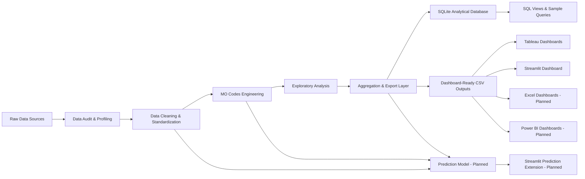
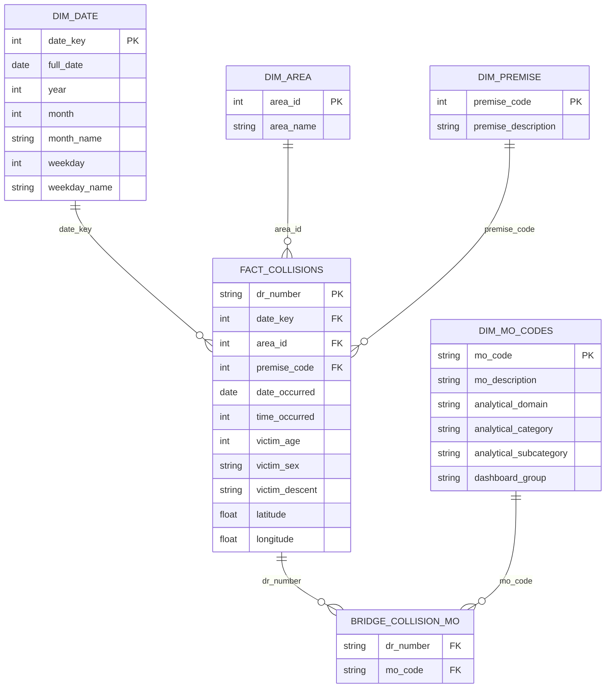
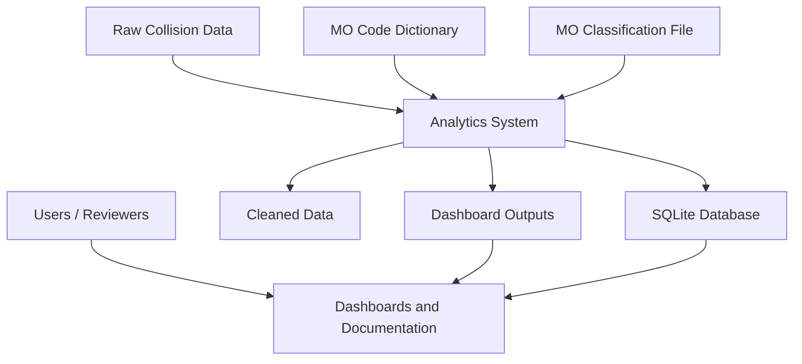
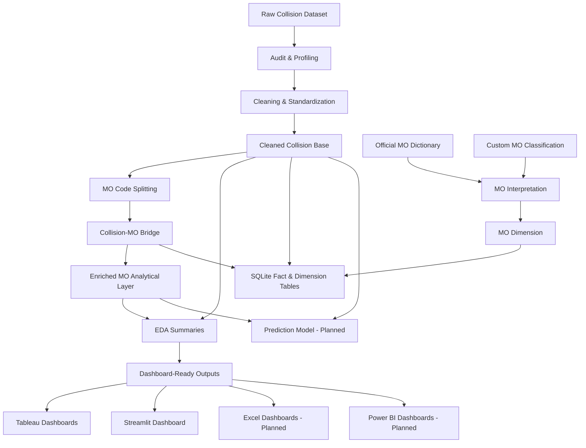

# 04 — System Analysis & Design

## Project Title

**LA Traffic Collision Intelligence Project**

---

## 1. Purpose of This Document

This document describes the system analysis and design for the **LA Traffic Collision Intelligence Project**. It explains the problem being solved, project objectives, system architecture, data flow, database design, dashboard design, technology stack, and future prediction extension.

The goal is to show how the project transforms raw Los Angeles traffic collision records into a structured analytics and decision-support system using Python, SQLite, Tableau, Streamlit, and planned Excel, Power BI, and prediction modules.

---

## 2. Problem Statement

The raw Los Angeles traffic collision dataset contains a large number of collision records with multiple fields related to date, time, area, victim information, premise, address, location, and MO codes.

Although the raw data is valuable, it is not directly ready for analysis because it includes several challenges:

- large data volume
- coded MO values that are difficult to understand directly
- multi-value MO code fields
- missing or incomplete values
- geographic coordinate quality issues
- partial-year reporting risk
- categorical inconsistencies
- dashboard performance concerns when using raw-level records
- need for clear documentation and repeatable delivery

The main problem is that raw collision records need to be transformed into a clean, structured, explainable, and dashboard-ready analytical system.

---

## 3. System Objectives

The system is designed to achieve the following objectives:

1. load and profile raw traffic collision records
2. clean and standardize key data fields
3. validate date, time, location, victim, premise, and MO-code fields
4. transform raw MO codes into meaningful analytical categories
5. normalize many-to-many collision-to-MO relationships
6. create SQL-ready fact and dimension tables
7. implement a validated SQLite analytical database
8. generate dashboard-ready summary datasets
9. support Tableau, Streamlit, Excel, and Power BI dashboards
10. support future prediction model development
11. provide professional GitHub-ready documentation

---

## 4. System Boundary

The system covers the full analytical workflow from raw data to dashboards.

### In Scope

- data audit and profiling
- data cleaning and standardization
- MO-code classification and engineering
- exploratory analysis
- aggregation and export layer
- SQLite implementation
- SQL views and sample queries
- Tableau dashboards
- Streamlit dashboard application
- planned Excel dashboards
- planned Power BI dashboards
- planned prediction model
- planned prediction integration into Streamlit

### Out of Scope for Current Design

- official production deployment by a government agency
- live data ingestion from external APIs
- real-time traffic monitoring
- automated cloud scheduling
- final machine learning deployment
- official public safety policy recommendation system

---

## 5. High-Level System Architecture

The project follows a layered analytics architecture.

**Diagram Note:** The diagram below is written using **Mermaid syntax**, which GitHub can render automatically as a visual flowchart. If it is viewed as plain text, the arrows should be read as data movement from one component to another.



### Architecture Style

The system follows a modular data analytics architecture with separated layers:

1. **Raw Data Layer** — original source files
2. **Data Preparation Layer** — audit, cleaning, standardization
3. **Semantic Enrichment Layer** — MO code classification and enrichment
4. **Analytical Layer** — EDA and summary outputs
5. **Database Layer** — SQLite fact, dimension, bridge, and view structures
6. **Presentation Layer** — Tableau, Streamlit, Excel, and Power BI dashboards
7. **Prediction Layer** — planned machine learning extension

---

## 6. Input Data Design

The project starts with three main input files.

| Input | Description | Role in System |
|---|---|---|
| Traffic Collision Dataset | Large raw dataset with 621,000+ records and 18 original columns | Main collision fact source |
| Official MO Codes Dictionary | Reference file containing official MO code meanings | Supports MO interpretation |
| MO Codes Classification File | Custom file created by the project team | Converts MO codes into analytical domains, categories, and subcategories |

---

## 7. Data Processing Design

The data processing workflow is divided into five core stages.

## 7.1 Stage 1 — Data Audit and Profiling

### Purpose

To understand the raw dataset before cleaning or modeling.

### Main Checks

- file loading validation
- schema review
- data type review
- missing value analysis
- duplicate record checks
- duplicate identifier checks
- date coverage review
- time field readiness
- coordinate quality review
- raw MO code availability
- MO mapping readiness

### Output

A clear understanding of raw data quality and initial risks.

---

## 7.2 Stage 2 — Data Cleaning and Standardization

### Purpose

To convert raw data into a trusted analytical base.

### Main Processing Steps

- standardize column names
- parse occurrence and reporting dates
- validate time fields
- derive year, month, weekday, and hour features
- clean text fields
- validate victim fields
- validate premise fields
- parse latitude and longitude
- validate coordinate plausibility
- create supporting dimension tables

### Output

Cleaned analytical collision data and supporting dimensions.

---

## 7.3 Stage 3 — MO Codes Engineering

### Purpose

To convert raw MO codes into an analysis-ready structure.

### Main Processing Steps

- identify records with MO codes
- split multi-value MO fields into individual codes
- create collision-to-MO bridge table
- join MO codes to the custom classification layer
- create MO dimension table
- identify unmapped MO codes
- create enriched MO analytical outputs

### Output

Normalized and classified MO-code structures.

---

## 7.4 Stage 4 — Exploratory Data Analysis

### Purpose

To create the analytical story of the project.

### Analysis Areas

- annual trends
- monthly trends
- weekday-hour patterns
- area-level patterns
- reporting division patterns
- premise patterns
- injury severity
- hit-and-run indicators
- DUI/sobriety indicators
- victim demographics
- vulnerable users
- MO analytical domains, categories, and subcategories

### Output

Analytical insight tables and project narrative findings.

---

## 7.5 Stage 5 — Aggregation and Export Layer

### Purpose

To prepare governed outputs for dashboards and SQL implementation.

### Main Outputs

- yearly summary
- monthly summary
- weekday-hour summary
- area summary
- reporting division summary
- premise summary
- injury severity summary
- hit-and-run summary
- DUI/sobriety summary
- victim profile summaries
- MO analytical summaries
- traffic-only MO summaries
- map collision points
- hotspot coordinate summaries

### Output Destinations

- Excel-ready folder
- SQL-ready folder
- Tableau-ready folder
- Power BI-ready folder
- Streamlit-ready usage through the shared output layer

---

## 8. Database Design

The system uses **SQLite** as the analytical database engine.

The database design follows a fact-and-dimension model with a bridge table for the many-to-many relationship between collisions and MO codes.

## 8.1 Entity Relationship Design

**Diagram Note:** The following ERD is written using Mermaid syntax. In GitHub preview, it should appear as a visual entity-relationship diagram. In plain text mode, the arrows describe relationships between database tables.



---

## 8.2 Core Tables

| Table | Type | Primary Key | Purpose |
|---|---|---|---|
| `fact_collisions` | Fact table | `dr_number` | Stores cleaned collision-level records |
| `dim_date` | Dimension table | `date_key` | Supports time-based analysis |
| `dim_area` | Dimension table | `area_id` | Supports area-level analysis |
| `dim_premise` | Dimension table | `premise_code` | Supports premise and scene-context analysis |
| `dim_mo_codes` | Dimension table | `mo_code` | Stores classified MO code metadata |
| `bridge_collision_mo` | Bridge table | composite key | Supports many-to-many collision-to-MO relationships |

---

## 8.3 Database Relationship Logic

### Collision to Date

Each collision links to a date record through `date_key`.

### Collision to Area

Each collision links to an area record through `area_id`.

### Collision to Premise

Each collision may link to a premise record through `premise_code`.

### Collision to MO Codes

A collision may have multiple MO codes, and the same MO code can appear in many collisions. Therefore, the relationship is modeled using `bridge_collision_mo`.

---

## 8.4 SQL Views

The database includes reusable analytical views to support reporting and analysis.

| View | Purpose |
|---|---|
| `vw_yearly_collision_summary` | Year-level collision trends |
| `vw_area_collision_summary` | Area-level collision ranking |
| `vw_premise_collision_summary` | Premise-based collision summary |
| `vw_reporting_district_summary` | Reporting district analysis |
| `vw_time_of_day_collision_summary` | Time-of-day analysis |
| `vw_mo_domain_summary` | MO domain-level summary |
| `vw_mo_analytical_domain_summary` | Analytical MO domain reporting |
| `vw_mo_analytical_category_summary` | Analytical MO category reporting |

---

## 9. Data Flow Design

## 9.1 Context-Level Data Flow

**Diagram Note:** The following diagrams use Mermaid syntax. They are included so the documentation can be rendered directly on GitHub without needing separate diagram files.



## 9.2 Detailed Data Flow



---

## 10. Application Design — Streamlit Dashboard

The Streamlit dashboard is designed as a multi-page web application.

## 10.1 Streamlit Application Structure

```text
streamlit_app/
├── app.py
├── utils/
│   ├── loaders.py
│   └── formatters.py
└── pages/
    ├── executive_overview.py
    ├── time_analysis.py
    ├── location_analysis.py
    ├── risk_severity.py
    ├── mo_analysis.py
    └── victim_profile.py
```

## 10.2 Streamlit Page Design

| Page | Purpose |
|---|---|
| Executive Overview | High-level KPIs, annual trend, top area, severity, hit-and-run, vulnerable users |
| Time Analysis | Yearly, monthly, weekday, and hourly collision patterns |
| Location Analysis | Area ranking, reporting division analysis, hotspot map, premise analysis |
| Risk and Severity | Fatal, severe, non-injury, hit-and-run, and DUI/sobriety indicators |
| MO Analysis | MO domain, category, subcategory, and traffic-only analysis |
| Victim Profile | Victim age group, sex, descent, and vulnerable user analysis |

## 10.3 Streamlit Design Principles

- modular page structure
- reusable loader functions
- reusable formatting utilities
- dashboard-ready summary inputs
- cached data loading for performance
- clear KPI cards
- visual charts and tables
- explanatory notes for interpretation

---

## 11. BI Dashboard Design

The BI dashboard layer is designed to support visual storytelling and interactive exploration.

## 11.1 Tableau Dashboard Design

Five Tableau dashboards have been created:

| Dashboard | Purpose | Status |
|---|---|---|
| Executive Overview | Shows key project KPIs and high-level collision summary | Functional, final formatting pending |
| Time Intelligence | Shows annual, monthly, weekday, and hourly patterns | Functional, final formatting pending |
| Geographic Hotspots & Area Explorer | Shows area patterns, maps, and hotspots | Functional, final formatting pending |
| Victim Demographics Explorer | Shows victim age, sex, descent, and vulnerable users | Functional, final formatting pending |
| MO Intelligence & Collision Pattern Explorer | Shows MO domains, categories, and collision pattern signals | Functional, final formatting pending |

## 11.2 Planned Excel Dashboard Design

The Excel dashboard layer will provide lightweight reporting based on summary outputs.

Expected Excel dashboard features:

- pivot tables
- KPI cards
- trend charts
- slicers
- area ranking
- severity summary
- victim profile summary
- MO summary charts

## 11.3 Planned Power BI Dashboard Design

The Power BI dashboard layer will provide interactive Microsoft BI reporting.

Expected Power BI features:

- data model built from prepared CSV outputs
- slicers for year, area, severity, and MO groups
- KPI cards
- trend visuals
- map visuals
- victim demographics
- risk and severity analysis
- MO code analysis

---

## 12. Prediction Model Design — Planned Extension

The prediction model is planned as a future system extension.

## 12.1 Prediction Purpose

The prediction model will use the cleaned and engineered project data to support future risk intelligence.

Possible prediction targets include:

- collision severity class
- high-risk collision likelihood
- hotspot recurrence risk
- vulnerable-user involvement
- area-level collision risk

## 12.2 Candidate Input Features

Potential model features include:

- year
- month
- weekday
- hour
- area
- reporting division
- premise type
- victim age group
- victim sex
- victim descent
- MO analytical domain
- MO analytical category
- MO analytical subcategory
- hit-and-run indicator
- DUI/sobriety indicator
- coordinate-based hotspot ranking

## 12.3 Prediction Integration

The prediction outputs are planned to be integrated into Streamlit through a new page or prediction section.

Possible integration options:

- display model performance metrics
- show feature importance
- allow users to select input conditions
- show predicted risk or severity class
- show high-risk areas based on model output

---

## 13. UI/UX Design Guidelines

The dashboards should follow the following UI/UX principles:

- use clear page titles
- use consistent KPI cards
- keep filters simple and visible
- avoid visual clutter
- use readable labels instead of raw codes
- separate executive, time, location, risk, MO, and victim views
- use maps only where geography adds value
- include notes for partial-year and data quality limitations
- keep color usage consistent across dashboards
- use final formatting before presentation delivery

---

## 14. Component Design

| Component | Description |
|---|---|
| Raw Data Component | Stores the original traffic collision dataset and reference files |
| Data Preparation Component | Performs audit, cleaning, and standardization |
| MO Engineering Component | Splits, normalizes, maps, and classifies MO codes |
| Aggregation Component | Creates summary outputs for dashboards and SQL |
| SQLite Component | Stores structured analytical tables and views |
| Streamlit Component | Provides interactive Python dashboard pages |
| Tableau Component | Provides BI storytelling dashboards |
| Excel Component | Planned lightweight dashboarding layer |
| Power BI Component | Planned interactive Microsoft BI layer |
| Prediction Component | Planned ML model and Streamlit integration |
| Documentation Component | Provides GitHub-ready project documentation |

---

## 15. Deployment and Repository Design

The project is designed to be delivered through GitHub.

Recommended repository structure:

```text
project_root/
├── data/
│   ├── raw/
│   └── cleaned/
├── notebooks/
│   ├── 01_data_audit_and_profiling.ipynb
│   ├── 02_data_cleaning_and_standardization.ipynb
│   ├── 03_mo_codes_engineering.ipynb
│   ├── 04_exploratory_data_analysis.ipynb
│   └── 05_aggregation_and_export_layer.ipynb
├── database/
│   └── la_traffic_collision.db
├── sql/
│   ├── create_tables_sqlite.sql
│   ├── index_recommendations_sqlite.sql
│   ├── analytical_views.sql
│   ├── sqlite_setup.sql
│   ├── schema_definition.sql
│   └── sample_queries.sql
├── outputs/
│   ├── excel_ready/
│   ├── sql_ready/
│   ├── tableau_ready/
│   ├── powerbi_ready/
│   ├── reports/
│   └── tables/
├── tableau/
│   ├── dashboard_01_executive_overview.twbx
│   ├── dashboard_02_time_intelligence.twbx
│   ├── dashboard_03_geographic_hotspots.twbx
│   ├── dashboard_04_victim_demographics.twbx
│   └── dashboard_05_mo_intelligence.twbx
├── streamlit_app/
│   ├── app.py
│   ├── utils/
│   │   ├── loaders.py
│   │   └── formatters.py
│   └── pages/
│       ├── executive_overview.py
│       ├── time_analysis.py
│       ├── location_analysis.py
│       ├── risk_severity.py
│       ├── mo_analysis.py
│       └── victim_profile.py
├── docs/
│   ├── 01_project_planning_and_management.md
│   ├── 02_literature_review.md
│   ├── 03_requirements_gathering.md
│   ├── 04_system_analysis_and_design.md
│   └── submission_01_summary.md
└── README.md
```

---

## 16. Security, Privacy, and Ethical Considerations

The project uses public traffic collision records and does not attempt to identify private individuals.

Key considerations:

- avoid presenting results as official city conclusions
- avoid exposing unnecessary personal-level details
- focus on aggregated analysis and public safety patterns
- clearly document limitations
- avoid overinterpreting coded or incomplete fields
- use prediction outputs carefully and explain uncertainty

---

## 17. Assumptions and Constraints

## 17.1 Assumptions

- the raw dataset is accepted as the main project source
- the official MO codes dictionary is a valid reference for code interpretation
- the custom MO classification layer is reviewed by the project team
- dashboard-ready outputs are suitable for Tableau, Excel, Power BI, and Streamlit
- SQLite is sufficient for academic and analytical delivery
- prediction will be added as a future extension after descriptive analytics are stable

## 17.2 Constraints

- raw data may contain missing or incomplete records
- some MO codes may not map perfectly to the available reference
- recent years may be partial and should be interpreted carefully
- dashboard performance may be affected by large row-level files
- final dashboards require formatting and polishing before presentation
- prediction model quality depends on feature availability and target definition

---

## 18. Validation Strategy

The system is validated through multiple checks.

| Validation Area | Validation Method |
|---|---|
| Raw data loading | Confirm files load successfully |
| Duplicate control | Check full-row duplicates and collision identifier duplicates |
| Date quality | Validate date parsing and coverage |
| Time quality | Validate time field readiness |
| Coordinate quality | Validate latitude and longitude plausibility |
| MO mapping | Measure mapped and unmapped MO codes |
| SQL database | Validate row counts and relationship integrity |
| Dashboard outputs | Check required summary files exist and load correctly |
| Streamlit app | Confirm each page loads required datasets |
| Tableau dashboards | Confirm dashboards use approved output files |
| Documentation | Confirm required documentation files exist and match actual workflow |

---

## 19. System Design Summary

The **LA Traffic Collision Intelligence Project** is designed as a structured analytics system that transforms raw collision data into trusted analytical outputs, SQL models, and dashboards.

The design separates the workflow into clear layers:

1. raw data input
2. data audit and cleaning
3. MO code classification and engineering
4. analysis and aggregation
5. SQLite database implementation
6. dashboard delivery
7. future prediction extension
8. project documentation

This structure improves maintainability, clarity, scalability, and review readiness. It also allows the project to support multiple delivery platforms while preserving a single governed analytical foundation.

